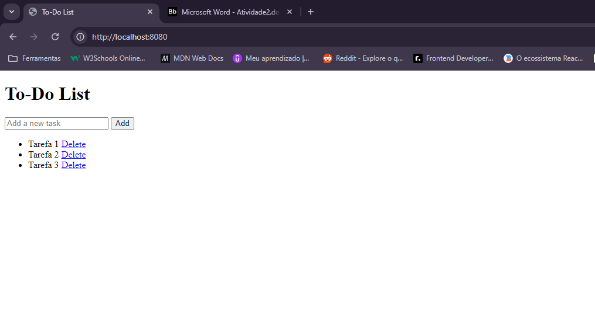

# Flask To-Do App

## Descrição

Este projeto é uma aplicação web simples de lista de tarefas (To-Do List) desenvolvida com Flask e contêinerizada utilizando Docker. A aplicação permite adicionar, visualizar e remover tarefas.

## Objetivo

O objetivo deste projeto é demonstrar como criar, configurar e executar uma aplicação web básica com funcionalidades de lista de tarefas usando Flask e Docker, além de contêinerizar a aplicação para facilitar a execução e o gerenciamento.

## Tecnologias Utilizadas

- **Flask:** Framework web para Python.
- **Docker:** Plataforma para criar, implantar e executar contêineres.
- **SQLite:** Sistema de gerenciamento de banco de dados relacional.

## Pré-requisitos

Antes de iniciar, certifique-se de que o Docker esteja instalado na sua máquina. Você pode instalar o Docker a partir da [página oficial](https://www.docker.com/products/docker-desktop).

## Estrutura do Projeto

- `app.py`: Código da aplicação Flask.
- `Dockerfile`: Arquivo de configuração para criar a imagem Docker.
- `requirements.txt`: Arquivo com as dependências do projeto.
- `templates/`: Pasta contendo os arquivos HTML utilizados pela aplicação.

## Configuração e Execução

### 1. Clone o Repositório

Clone este repositório para sua máquina local:

```bash
git clone https://github.com/xmurilo/flask-todo-app.git
```

```bash
cd flask-todo-app
```

## Aplicação rodando localmente


